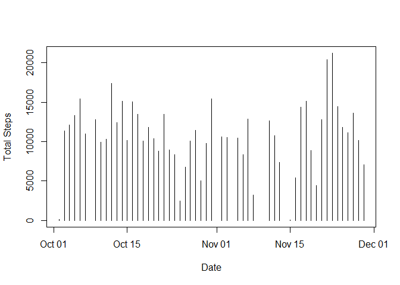
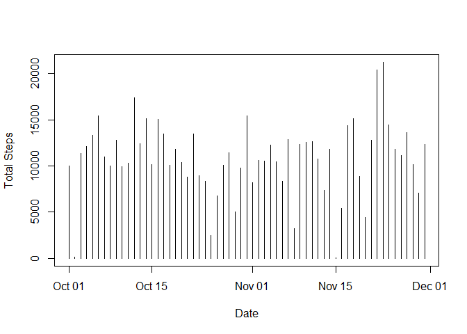
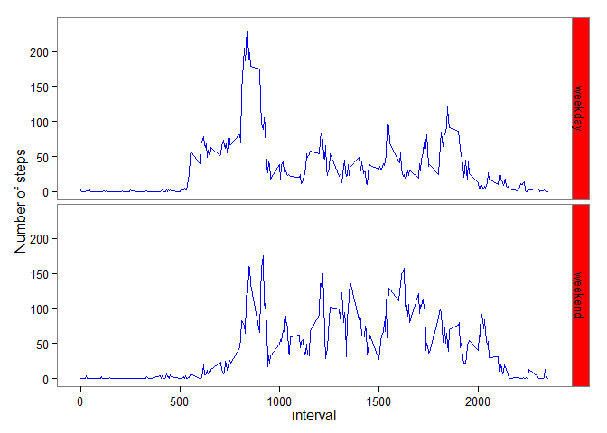

# Reproducible Research: Peer Assignment 1
  
  
### *Introduction*

It is now possible to collect a large amount of data about personal movement using activity monitoring devices such as a Fitbit, Nike Fuelband, or Jawbone Up. These type of devices are part of the "quantified self" movement - a group of enthusiasts who take measurements about themselves regularly to improve their health, to find patterns in their behavior, or because they are tech geeks. However, these data remain under-utilized because - **1.** the raw data are hard to obtain; and, **2.** there is a lack of statistical methods and software for processing and interpreting the data.


This assignment makes use of data from a personal activity monitoring device in assessing the following:  
**-** What is mean total number of steps taken per day?  
**-** What is the average daily activity pattern?  
**-** Imputing missing values  
**-** Are there differences in activity patterns between weekdays and weekends?


### *Data*

The data for this assignment is from the course web site: [Activity monitoring data][1] [52K]

The data was collected using this device that collects data at 5 minute intervals through out the day. The data consists of two months of data from an anonymous individual collected during the months of October and November, 2012 and include the number of steps taken in 5 minute intervals each day.

The variables included in this dataset are:

**steps:** Number of steps taking in a 5-minute interval (missing values are coded as NA)

**date:** The date on which the measurement was taken in YYYY-MM-DD format

**interval:** Identifier for the 5-minute interval in which measurement was taken

The dataset is stored in a comma-separated-value (CSV) file and there are a total of 17,568 observations in this dataset.


### *Analysis*

The analysis to assess the data will be performed in **R**. To do this, the data is it be downloaded to your machine, and extracted from zip folder. Then the working directory in **'R'** needs to be set to where the data is stored. In my case, it is set to *"~/BSS_Training/Coursera_R_WorkingDirectory/ReproducibleResearch/Assignment1"* using the following command:


```r
setwd("~/BSS_Training/Coursera_R_WorkingDirectory/ReproducibleResearch/Assignment1")
```


#### A. Loading and preprocessing the data


Once the environment is setup, the data will need to be loaded and trasformed in **R**. The following steps would need to be performed to make this happen. 

**STEP 1.** Load the Data into R.

```r
rawData <- read.csv("activity.csv")
```

**STEP 2.** Transform the Data.

```r
rawData <- transform(rawData, date = as.Date(date, "%Y-%m-%d"))
```


#### B. Calculating - mean total number of steps taken per day


**STEP 1.** Plot the Data

```r
tidyData <- rawData[!is.na(rawData$date) & !is.na(rawData$steps),]
histData <- tapply(tidyData$steps, tidyData$date, sum)
plot(as.Date(names(histData)), histData, type = "h", xlab = "Date", ylab = "Total Steps")
```

 

**STEP 2.** Calculate the Mean and Median of the Data

```r
meanSteps <- mean(histData)
medianSteps <- median(histData)
```

As per the calculations, 

* mean number of steps taken per day by the individual between October and November 2012 is 1.0766 &times; 10<sup>4</sup>

* median of the number of steps taken per day by the individual between October and November 2012 is 10765
  
  
  
#### C. Calculating - average daily activity pattern


**STEP 1.** Make a time series plot for average number of steps for a given interval across all days in the dataset


```r
tidyData <- rawData[!is.na(rawData$date) & !is.na(rawData$steps),]
plotData <- tapply(tidyData$steps, tidyData$interval, mean)
plot(names(plotData), plotData, type= "l", xlab = "Interval", ylab = "Average Steps")
```

 

**STEP 2.** Determine 5-minute interval, on average across all the days in the dataset, contains the maximum number of steps


```r
maxStepsInterval <- names(plotData[plotData == max(plotData)])
```

5-minute interval, on average across all the days in the dataset, containing the maximum number of steps is 835


#### D. Calculating - misssing value implication


**STEP 1.** Calculate number of rows with missing values

```r
rowMissingValue <- nrow(rawData[is.na(rawData$date) | is.na(rawData$steps) | is.na(rawData$interval),])
rowMissingDate <- nrow(rawData[is.na(rawData$date),])
rowMissingSteps <- nrow(rawData[is.na(rawData$steps),])
rowMissingIntervals <- nrow(rawData[is.na(rawData$interval),])
```

Total rows missing value: 2304

Rows missing date: 0

Rows missing steps: 2304

Rows missing intervals: 0


**STEP 2.** Strategy to replace NA values

Considering that values are only missing for **steps**, it may be relevant to come up with a strategy to populate the missing values in the dataset. Doing this may help remove the bias.

Assuming that this individual is used to a pattern in their life, it may be useful to use the mean of steps that this individual takes during the specific interval of time each day depending on whether it is a weekday or weekend.  


**STEP 3.** Implement the strategy to replace NA values - Create an imputed dataset


```r
rawData <- cbind(rawData, dayOfWeek = weekdays(rawData$date))
names(rawData)[4] <- "dayOfWeek" 

sumData <- aggregate(steps ~ weekdays(date) + interval, tidyData, mean)
names(sumData)[1] <- "dayOfWeek"
names(sumData)[3] <- "avgSteps"

NAVar <- merge(rawData, sumData, all.x = TRUE )
indxVar <- is.na(NAVar$steps)
NAVar[indxVar, 3] <- NAVar[indxVar, 5]
NAVar <- NAVar[,1:4]

tidy2Data <- NAVar[,c("steps", "date", "interval")]
```

**STEP 4.** Compute and Compare the stats from the dataset with imputed values with those from dataset without NA values. 

```r
histData <- tapply(tidy2Data$steps, tidy2Data$date, sum)
plot(as.Date(names(histData)), histData, type = "h", xlab = "Date", ylab = "Total Steps")
```

 


```r
newMeanSteps <- mean(histData)
newMedianSteps <- median(histData)
```

As per the calculations, 

* new mean number of steps taken per day by the individual between October and November 2012 is 1.0821 &times; 10<sup>4</sup>. This is 55.0209 steps greater than mean steps when NA rows have been removed.   

* median of the number of steps taken per day by the individual between October and November 2012 is 1.1015 &times; 10<sup>4</sup>. This is 250 steps greater than median steps when NA rows have been removed.


#### E. Exploring differences in activity patterns between weekdays and weekends

**STEP 1.** Create factor variable to indicate weekday or weekend

```r
weekDay <- c("weekday")
NAVar <- cbind(NAVar, weekDay)
NAVar$weekDay <- as.character(NAVar$weekDay)
wkEndRows <- nrow(NAVar[(NAVar$dayOfWeek == "Sunday" | 
              NAVar$dayOfWeek == "Saturday"), ])
NAVar[(NAVar$dayOfWeek == "Sunday" | 
              NAVar$dayOfWeek == "Saturday"), 5] <- 
        rep("weekend", wkEndRows)
NAVar$weekDay <- factor(NAVar$weekDay)
```


**STEP 1.** Plot average number of steps taken by the individual in a given interval of time over weekdays versus over weekends


```r
library(ggplot2)
plotData2 <- aggregate(steps ~ weekDay + interval, NAVar, mean)

g <- ggplot(plotData2, aes(interval, steps))
g + 
        geom_line(col = "blue") + 
        facet_grid(weekDay ~ .) + 
        labs( y = "Number of steps") +
        theme_bw() +
        theme(panel.grid = element_blank()) +
        theme(strip.background = element_rect(fill = "red"))
```

 

The plot shows that the activity levels tend to start a little later in the day during weekends, and also, the peak activity level during weekdays is much higher than that at the weekend. However, it is interesting to note that the activity level remains fairly high through the day on weekends, when compared with those during weekdays.

---
[1]: https://d396qusza40orc.cloudfront.net/repdata%2Fdata%2Factivity.zip
